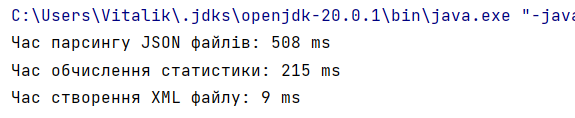

## **Project README**

### **Description:**

The project is designed to parse JSON files containing information about teachers and their subjects, calculate statistics based on specified attributes, and generate an XML report. This README provides an overview of the project's main entities, input and output file examples, and experimentation results regarding the performance of multithreading. Gson library gives us opportunity to receive files one by one and optimizes work of the project without direct downloading of files into the Java RAM.  

### Entities:

**Teacher:**
Represents a teacher entity with attributes such as name, surname, subject, and cities.

**Subject:**
Represents a subject entity with a name attribute.

### **Input Files:**

An example of an input JSON file containing information about teachers:

teachers1.json:
```
[
    {
        "Name": "John",
        "Surname": "Doe",
        "Subject": "Math",
        "Cities": "Lviv, Kyiv"
    },
    {
        "Name": "Alice",
        "Surname": "Smith",
        "Subject":  "Physics",
        "Cities": "Kyiv"
    },
    {
        "Name": "Michael",
        "Surname": "Johnson",
        "Subject":"Physics",
        "Cities": "Lviv"
    }
]
```

teachers2.json:
```
[
    {
        "Name": "John",
        "Surname": "Doe",
        "Subject": "Math",
        "Cities": "Lviv, Kyiv"
    },
    {
        "Name": "Alice",
        "Surname": "Smith",
        "Subject":  "Physics",
        "Cities": "Kyiv"
    },
    {
        "Name": "Michael",
        "Surname": "Johnson",
        "Subject":"Physics",
        "Cities": "Lviv"
    }
]
```

### Output File:

An example of the generated XML statistics report:

```
<statistics>
    <item>
        <value>Lviv</value>
        <count>4</count>
    </item>
    <item>
        <value>Kyiv</value>
        <count>4</count>
    </item>
</statistics>
```

### Experimentation Results:

The project experimented with different numbers of threads for parsing JSON files concurrently. The performance results varied based on the hardware and the number of available processor cores. Generally, an increase in the number of threads up to the number of available processor cores improved processing speed.

**Example with 10 separate threads for 10 files**


**Example with 4 separate threads for 4 files**


**Example with 2 separate threads for 2 files**

We can see that time is very similar thanks to the threads which gives opportunity to work concurrently

For optimal performance, it's recommended to adjust the number of threads based on the available hardware resources and the size of the input data.


